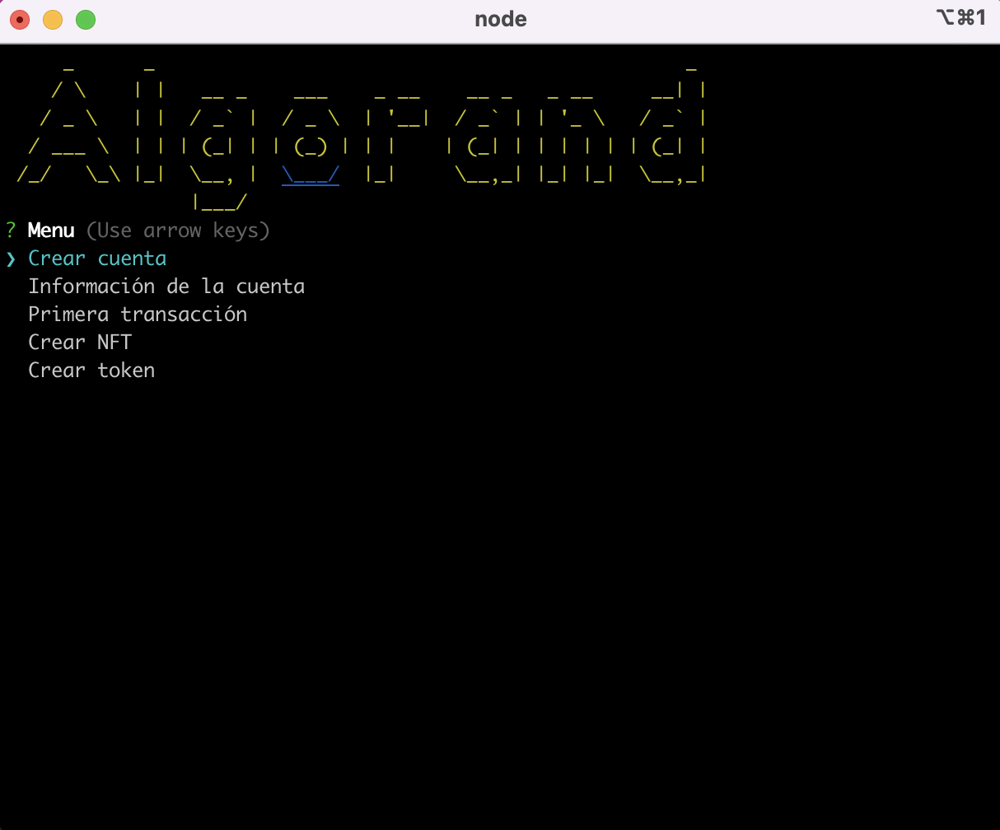

# Algorand Javascript SDK Playground




## Installation

OS X & Linux:

```sh
git clone https://github.com/lucaford/algorand-javascript-sdk-playground.git

cd algorand-javascript-sdk-playground
```

yarn

```sh
yarn install
```

npm

```sh
npm install
```

## Pre-Requisites

### Algorand Test Node w/Docker

```sh
git clone https://github.com/algorand/sandbox.git
cd sandbox
./sandbox up testnet
```

## Usage

### Start project CLI

```sh
yarn start
```

### Clean dependencies

```sh
yarn clean
```

## Contact

Luca Ford – [@lfordev](https://twitter.com/lfordev)

Distributed under the MIT license.
